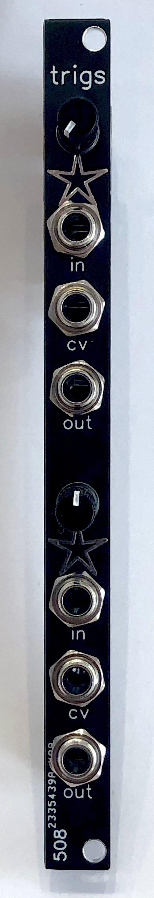

# 2HP dual gate to trigger conditioner

A lot of my percussion modules are expecting well-formed triggers, but clocks and other things typically put out gates. This is a dual gate-to-trigger conditioner -- it will narrow just about any gate down to proper trigger width, but its output is also fully adjustable from 0ms up to the full width of the original gate. So you can use it if, for example, you're using a clock divider that puts out double-length gates that you want to shape back down to the same width as the rest of the gates you're using. Or anything else along those lines.

The trigger/gate width is fully CV controllable across the same range that the knob gives you.

The input of the top half is normalled to the input of the bottom half, in case you want 2 different lengths from the same gate input.
